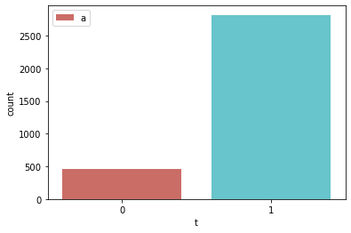
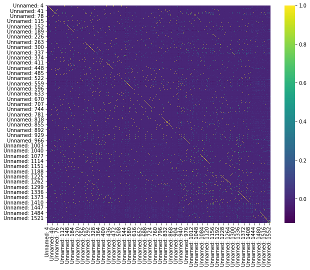

##### Author : Amir Shokri
##### github link : https://github.com/amirshnll/Internet-Advertisements
##### dataset link : http://archive.ics.uci.edu/ml/datasets/Internet+Advertisements
##### email : amirsh.nll@gmail.com

```python
import numpy as np 
import pandas as pd 
import matplotlib.pyplot as plt 
import  seaborn as sns
```


```python
ads=pd.read_csv('adsdata.csv')
#ads.head(500)
```


```python
#from  pandas.plotting import scatter_matrixe
######### train_test_split  ############
#from sklearn.model_selection import train_test_split
#x=final.t
#y=df_num
#y_train , y_test ,x_train, x_test= train_test_split(y,x,test_size=0.2, random_state=30)
#train_set.shap
#print("x_train _set:", y_train.shape)
#print("x_test_set:",y_test.shape)
#print("y_train _set:", x_train.shape)
#print("y_test_set:",x_test.shape)
########
df=train_set.copy()
df_lable=df["t"].copy()
df= ads.drop(("t"),axis=1)
df_num=df.drop("A", axis=1)
df_num=df_num.drop("B", axis=1)
df_num=df_num.drop("C", axis=1)
df_num=df_num.drop("D", axis=1)
#df_num
```


```python
#from  pandas.plotting import scatter_matrixe
######### train_test_split  ############
from sklearn.model_selection import train_test_split
y=final.t
y_train , y_test ,df_num_train, df_num_test= train_test_split(y,df_num,test_size=0.2, random_state=30)
#train_set.shap
print("df_num_train _set:", df_num_train.shape)
print("df_num_test_set:",df_num_test.shape)
print("y_train _set:", y_train.shape)
print("y_test_set:",y_test.shape)
########
df=train_set.copy()
df_lable=df["t"].copy()
df= ads.drop(("t"),axis=1)
df_num=df.drop("A", axis=1)
df_num=df_num.drop("B", axis=1)
df_num=df_num.drop("C", axis=1)
df_num=df_num.drop("D", axis=1)
df_num
```

    x_train _set: (2623, 1554)
    x_test_set: (656, 1554)
    y_train _set: (2623,)
    y_test_set: (656,)
    


<div>
<style scoped>
    .dataframe tbody tr th:only-of-type {
        vertical-align: middle;
    }

    .dataframe tbody tr th {
        vertical-align: top;
    }

    .dataframe thead th {
        text-align: right;
    }
</style>
<table border="1" class="dataframe">
  <thead>
    <tr style="text-align: right;">
      <th></th>
      <th>Unnamed: 4</th>
      <th>Unnamed: 5</th>
      <th>Unnamed: 6</th>
      <th>Unnamed: 7</th>
      <th>Unnamed: 8</th>
      <th>Unnamed: 9</th>
      <th>Unnamed: 10</th>
      <th>Unnamed: 11</th>
      <th>Unnamed: 12</th>
      <th>Unnamed: 13</th>
      <th>...</th>
      <th>Unnamed: 1548</th>
      <th>Unnamed: 1549</th>
      <th>Unnamed: 1550</th>
      <th>Unnamed: 1551</th>
      <th>Unnamed: 1552</th>
      <th>Unnamed: 1553</th>
      <th>Unnamed: 1554</th>
      <th>Unnamed: 1555</th>
      <th>Unnamed: 1556</th>
      <th>Unnamed: 1557</th>
    </tr>
  </thead>
  <tbody>
    <tr>
      <th>0</th>
      <td>0</td>
      <td>0</td>
      <td>0</td>
      <td>0</td>
      <td>0</td>
      <td>0</td>
      <td>0</td>
      <td>0</td>
      <td>0</td>
      <td>0</td>
      <td>...</td>
      <td>0</td>
      <td>0</td>
      <td>0</td>
      <td>0</td>
      <td>0</td>
      <td>0</td>
      <td>0</td>
      <td>0</td>
      <td>0</td>
      <td>0</td>
    </tr>
    <tr>
      <th>1</th>
      <td>0</td>
      <td>0</td>
      <td>0</td>
      <td>0</td>
      <td>0</td>
      <td>0</td>
      <td>0</td>
      <td>0</td>
      <td>0</td>
      <td>0</td>
      <td>...</td>
      <td>0</td>
      <td>0</td>
      <td>0</td>
      <td>0</td>
      <td>0</td>
      <td>0</td>
      <td>0</td>
      <td>0</td>
      <td>0</td>
      <td>0</td>
    </tr>
    <tr>
      <th>2</th>
      <td>0</td>
      <td>0</td>
      <td>0</td>
      <td>0</td>
      <td>0</td>
      <td>0</td>
      <td>0</td>
      <td>0</td>
      <td>0</td>
      <td>0</td>
      <td>...</td>
      <td>0</td>
      <td>0</td>
      <td>0</td>
      <td>0</td>
      <td>0</td>
      <td>0</td>
      <td>0</td>
      <td>0</td>
      <td>0</td>
      <td>0</td>
    </tr>
    <tr>
      <th>3</th>
      <td>0</td>
      <td>0</td>
      <td>0</td>
      <td>0</td>
      <td>0</td>
      <td>0</td>
      <td>0</td>
      <td>0</td>
      <td>0</td>
      <td>0</td>
      <td>...</td>
      <td>0</td>
      <td>0</td>
      <td>0</td>
      <td>0</td>
      <td>0</td>
      <td>0</td>
      <td>0</td>
      <td>0</td>
      <td>0</td>
      <td>0</td>
    </tr>
    <tr>
      <th>4</th>
      <td>0</td>
      <td>0</td>
      <td>0</td>
      <td>0</td>
      <td>0</td>
      <td>0</td>
      <td>0</td>
      <td>0</td>
      <td>0</td>
      <td>0</td>
      <td>...</td>
      <td>0</td>
      <td>0</td>
      <td>0</td>
      <td>0</td>
      <td>0</td>
      <td>0</td>
      <td>0</td>
      <td>0</td>
      <td>0</td>
      <td>0</td>
    </tr>
    <tr>
      <th>...</th>
      <td>...</td>
      <td>...</td>
      <td>...</td>
      <td>...</td>
      <td>...</td>
      <td>...</td>
      <td>...</td>
      <td>...</td>
      <td>...</td>
      <td>...</td>
      <td>...</td>
      <td>...</td>
      <td>...</td>
      <td>...</td>
      <td>...</td>
      <td>...</td>
      <td>...</td>
      <td>...</td>
      <td>...</td>
      <td>...</td>
      <td>...</td>
    </tr>
    <tr>
      <th>3274</th>
      <td>0</td>
      <td>0</td>
      <td>0</td>
      <td>0</td>
      <td>0</td>
      <td>0</td>
      <td>0</td>
      <td>0</td>
      <td>0</td>
      <td>0</td>
      <td>...</td>
      <td>0</td>
      <td>0</td>
      <td>0</td>
      <td>0</td>
      <td>0</td>
      <td>0</td>
      <td>0</td>
      <td>0</td>
      <td>0</td>
      <td>0</td>
    </tr>
    <tr>
      <th>3275</th>
      <td>0</td>
      <td>0</td>
      <td>0</td>
      <td>0</td>
      <td>0</td>
      <td>0</td>
      <td>0</td>
      <td>0</td>
      <td>0</td>
      <td>0</td>
      <td>...</td>
      <td>0</td>
      <td>0</td>
      <td>0</td>
      <td>0</td>
      <td>0</td>
      <td>0</td>
      <td>0</td>
      <td>0</td>
      <td>0</td>
      <td>0</td>
    </tr>
    <tr>
      <th>3276</th>
      <td>0</td>
      <td>0</td>
      <td>0</td>
      <td>0</td>
      <td>0</td>
      <td>0</td>
      <td>0</td>
      <td>0</td>
      <td>0</td>
      <td>0</td>
      <td>...</td>
      <td>0</td>
      <td>0</td>
      <td>0</td>
      <td>0</td>
      <td>0</td>
      <td>0</td>
      <td>0</td>
      <td>0</td>
      <td>0</td>
      <td>0</td>
    </tr>
    <tr>
      <th>3277</th>
      <td>0</td>
      <td>0</td>
      <td>0</td>
      <td>0</td>
      <td>0</td>
      <td>0</td>
      <td>0</td>
      <td>0</td>
      <td>0</td>
      <td>0</td>
      <td>...</td>
      <td>0</td>
      <td>0</td>
      <td>0</td>
      <td>0</td>
      <td>0</td>
      <td>0</td>
      <td>0</td>
      <td>0</td>
      <td>0</td>
      <td>0</td>
    </tr>
    <tr>
      <th>3278</th>
      <td>0</td>
      <td>0</td>
      <td>0</td>
      <td>0</td>
      <td>0</td>
      <td>0</td>
      <td>0</td>
      <td>0</td>
      <td>0</td>
      <td>0</td>
      <td>...</td>
      <td>0</td>
      <td>0</td>
      <td>0</td>
      <td>0</td>
      <td>0</td>
      <td>0</td>
      <td>0</td>
      <td>0</td>
      <td>0</td>
      <td>0</td>
    </tr>
  </tbody>
</table>
<p>3279 rows × 1554 columns</p>
</div>


```python
#from sklearn.preprocessing import OneHotEncoder 
#encoder_1hot =OneHotEncoder(sparse=False)
#data_cat_1hot_tmp=encoder_1hot.fit_transform(ads[["t"]])
#data_cat_1hot=pd.DataFrame(data_cat_1hot_tmp)
#data_cat_1hot.columns=encoder_1hot.get_feature_names(['test'])
#data_cat_1hot.head()
##############################final Data##########################
#final=pd.concat([     df_num      ,  data_cat_1hot   ],axis=1)
#final.head(10)                            
```


```python
#final.head(10)
#final.describe()
#import  seaborn as sns
#sns.countplot(x='test', data=final ,palette='hls')
#plt.show()
```


<div>
<style scoped>
    .dataframe tbody tr th:only-of-type {
        vertical-align: middle;
    }

    .dataframe tbody tr th {
        vertical-align: top;
    }

    .dataframe thead th {
        text-align: right;
    }
</style>
<table border="1" class="dataframe">
  <thead>
    <tr style="text-align: right;">
      <th></th>
      <th>Unnamed: 4</th>
      <th>Unnamed: 5</th>
      <th>Unnamed: 6</th>
      <th>Unnamed: 7</th>
      <th>Unnamed: 8</th>
      <th>Unnamed: 9</th>
      <th>Unnamed: 10</th>
      <th>Unnamed: 11</th>
      <th>Unnamed: 12</th>
      <th>Unnamed: 13</th>
      <th>...</th>
      <th>Unnamed: 1550</th>
      <th>Unnamed: 1551</th>
      <th>Unnamed: 1552</th>
      <th>Unnamed: 1553</th>
      <th>Unnamed: 1554</th>
      <th>Unnamed: 1555</th>
      <th>Unnamed: 1556</th>
      <th>Unnamed: 1557</th>
      <th>test_ad.</th>
      <th>test_nonad.</th>
    </tr>
  </thead>
  <tbody>
    <tr>
      <th>count</th>
      <td>3279.000000</td>
      <td>3279.000000</td>
      <td>3279.000000</td>
      <td>3279.000000</td>
      <td>3279.000000</td>
      <td>3279.000000</td>
      <td>3279.000000</td>
      <td>3279.000000</td>
      <td>3279.000000</td>
      <td>3279.000000</td>
      <td>...</td>
      <td>3279.000000</td>
      <td>3279.000000</td>
      <td>3279.000000</td>
      <td>3279.000000</td>
      <td>3279.000000</td>
      <td>3279.000000</td>
      <td>3279.000000</td>
      <td>3279.000000</td>
      <td>3279.000000</td>
      <td>3279.000000</td>
    </tr>
    <tr>
      <th>mean</th>
      <td>0.004270</td>
      <td>0.011589</td>
      <td>0.004575</td>
      <td>0.003355</td>
      <td>0.003965</td>
      <td>0.011589</td>
      <td>0.003355</td>
      <td>0.004880</td>
      <td>0.009149</td>
      <td>0.004575</td>
      <td>...</td>
      <td>0.003660</td>
      <td>0.002440</td>
      <td>0.003050</td>
      <td>0.006404</td>
      <td>0.012809</td>
      <td>0.013419</td>
      <td>0.009759</td>
      <td>0.001525</td>
      <td>0.139982</td>
      <td>0.860018</td>
    </tr>
    <tr>
      <th>std</th>
      <td>0.065212</td>
      <td>0.107042</td>
      <td>0.067491</td>
      <td>0.057831</td>
      <td>0.062850</td>
      <td>0.107042</td>
      <td>0.057831</td>
      <td>0.069694</td>
      <td>0.095227</td>
      <td>0.067491</td>
      <td>...</td>
      <td>0.060393</td>
      <td>0.049341</td>
      <td>0.055148</td>
      <td>0.079783</td>
      <td>0.112466</td>
      <td>0.115077</td>
      <td>0.098320</td>
      <td>0.039026</td>
      <td>0.347021</td>
      <td>0.347021</td>
    </tr>
    <tr>
      <th>min</th>
      <td>0.000000</td>
      <td>0.000000</td>
      <td>0.000000</td>
      <td>0.000000</td>
      <td>0.000000</td>
      <td>0.000000</td>
      <td>0.000000</td>
      <td>0.000000</td>
      <td>0.000000</td>
      <td>0.000000</td>
      <td>...</td>
      <td>0.000000</td>
      <td>0.000000</td>
      <td>0.000000</td>
      <td>0.000000</td>
      <td>0.000000</td>
      <td>0.000000</td>
      <td>0.000000</td>
      <td>0.000000</td>
      <td>0.000000</td>
      <td>0.000000</td>
    </tr>
    <tr>
      <th>25%</th>
      <td>0.000000</td>
      <td>0.000000</td>
      <td>0.000000</td>
      <td>0.000000</td>
      <td>0.000000</td>
      <td>0.000000</td>
      <td>0.000000</td>
      <td>0.000000</td>
      <td>0.000000</td>
      <td>0.000000</td>
      <td>...</td>
      <td>0.000000</td>
      <td>0.000000</td>
      <td>0.000000</td>
      <td>0.000000</td>
      <td>0.000000</td>
      <td>0.000000</td>
      <td>0.000000</td>
      <td>0.000000</td>
      <td>0.000000</td>
      <td>1.000000</td>
    </tr>
    <tr>
      <th>50%</th>
      <td>0.000000</td>
      <td>0.000000</td>
      <td>0.000000</td>
      <td>0.000000</td>
      <td>0.000000</td>
      <td>0.000000</td>
      <td>0.000000</td>
      <td>0.000000</td>
      <td>0.000000</td>
      <td>0.000000</td>
      <td>...</td>
      <td>0.000000</td>
      <td>0.000000</td>
      <td>0.000000</td>
      <td>0.000000</td>
      <td>0.000000</td>
      <td>0.000000</td>
      <td>0.000000</td>
      <td>0.000000</td>
      <td>0.000000</td>
      <td>1.000000</td>
    </tr>
    <tr>
      <th>75%</th>
      <td>0.000000</td>
      <td>0.000000</td>
      <td>0.000000</td>
      <td>0.000000</td>
      <td>0.000000</td>
      <td>0.000000</td>
      <td>0.000000</td>
      <td>0.000000</td>
      <td>0.000000</td>
      <td>0.000000</td>
      <td>...</td>
      <td>0.000000</td>
      <td>0.000000</td>
      <td>0.000000</td>
      <td>0.000000</td>
      <td>0.000000</td>
      <td>0.000000</td>
      <td>0.000000</td>
      <td>0.000000</td>
      <td>0.000000</td>
      <td>1.000000</td>
    </tr>
    <tr>
      <th>max</th>
      <td>1.000000</td>
      <td>1.000000</td>
      <td>1.000000</td>
      <td>1.000000</td>
      <td>1.000000</td>
      <td>1.000000</td>
      <td>1.000000</td>
      <td>1.000000</td>
      <td>1.000000</td>
      <td>1.000000</td>
      <td>...</td>
      <td>1.000000</td>
      <td>1.000000</td>
      <td>1.000000</td>
      <td>1.000000</td>
      <td>1.000000</td>
      <td>1.000000</td>
      <td>1.000000</td>
      <td>1.000000</td>
      <td>1.000000</td>
      <td>1.000000</td>
    </tr>
  </tbody>
</table>
<p>8 rows × 1556 columns</p>
</div>


```python
from sklearn.preprocessing import LabelEncoder
encoder=LabelEncoder()
data_adc=ads["t"]
data_adc_encode=encoder.fit_transform(data_adc)
data_adc_encode= pd.DataFrame(data_adc_encode,columns=["t"])
#data_adc_encode.head(500)
##############################final Data##########################
final=pd.concat([     df_num      , data_adc_encode   ],axis=1)
final.head(1000) 
final.info()
```

    <class 'pandas.core.frame.DataFrame'>
    RangeIndex: 3279 entries, 0 to 3278
    Columns: 1555 entries, Unnamed: 4 to t
    dtypes: int32(1), int64(1554)
    memory usage: 38.9 MB
    


```python
import matplotlib.pyplot as plt
import numpy as np 
#df_num.hist(bins=40, figsize=(40,40))
#plt.show()
import  seaborn as sns
sns.countplot(x='t', data=final ,palette='hls' )
#plt.bar(lable='o')
plt.legend('ad')
plt.show()
count_ads_sub=len(final[final['t']==0])
count_ads=len(final[final['t']==1])
pct_of_ad=count_ads_sub/(count_ads_sub+count_ads)
print("pct_of Data_ad:",pct_of_ad*100)
pct_of_noad=count_ads/(count_ads_sub+count_ads)
print("pct_of Data_nonad:",pct_of_noad*100)
#sns.countplot(x='test_ad.', data=final ,palette='hls')
#plt.show()
```





    pct_of Data_ad: 13.998170173833484
    pct_of Data_nonad: 86.00182982616651
    


```python
plt.figure(figsize=(10,8))
sns.heatmap(df.corr(),cmap='viridis')
```


    <AxesSubplot:>





```python
from sklearn.tree import DecisionTreeClassifier
from sklearn import metrics
from sklearn import preprocessing
from sklearn.metrics import accuracy_score
dtc=DecisionTreeClassifier()
dtc=dtc.fit(df_num_train,y_train)
dt=dtc.predict(df_num_test)
from sklearn.metrics import classification_report
print (classification_report(y_test,dtc.predict(df_num_test)))
print('Accuacy of Desition Tree Classifire on test set:{:.2f}' .format(dtc.score(df_num_test,y_test)))
from sklearn import tree
plt.figure(figsize=(20,20))
temp=tree.plot_tree(dtc.fit(df_num,y),fontsize=5)
plt.show()
```

                  precision    recall  f1-score   support
    
               0       0.84      0.82      0.83        79
               1       0.98      0.98      0.98       577
    
        accuracy                           0.96       656
       macro avg       0.91      0.90      0.91       656
    weighted avg       0.96      0.96      0.96       656
    
    Accuacy of Desition Tree Classifire on test set:0.96
    


```python
#*************      Naive Bayes clasifier       *******************
from sklearn.naive_bayes import GaussianNB
gnb = GaussianNB()
#gnb.fit(df_num_train, y_train())
y_pred =gnb.fit(df_num_train, y_train).predict(df_num_test)
#y_pred = gnb.predict(df_num_test)
print (classification_report(y_test,gnb.predict(df_num_test)))
print (' Naive Bayes test accuracy:  {:.2f} '.format(gnb.score(df_num_test, y_test)))
```

                  precision    recall  f1-score   support
    
               0       0.32      0.86      0.47        79
               1       0.98      0.75      0.85       577
    
        accuracy                           0.76       656
       macro avg       0.65      0.81      0.66       656
    weighted avg       0.90      0.76      0.80       656
    
     Naive Bayes test accuracy:  0.76 
    


```python
#******************          Mlp Classifier       ********************
from sklearn.neural_network import MLPClassifier
mpc=MLPClassifier(hidden_layer_sizes=(5,2), max_iter=1000)
mpc.fit(df_num_train, y_train)
y_predm=mpc.predict(df_num_test)
print ("Mlp Classifier  test accuracy: ", mpc.score(df_num_test, y_test))
print (classification_report(y_test,adsk.predict(df_num_test)))
print("knn(k=5) test accuracy;", adsk.score(df_num_test  , y_test))
```

    Mlp Classifier  test accuracy:  0.9634146341463414
                  precision    recall  f1-score   support
    
               0       0.88      0.81      0.84        79
               1       0.97      0.98      0.98       577
    
        accuracy                           0.96       656
       macro avg       0.93      0.90      0.91       656
    weighted avg       0.96      0.96      0.96       656
    
    


```python
#******************    <    logistic Regreession Classifier   >     ************************
from sklearn.linear_model import LogisticRegression
adsr=LogisticRegression(solver='1bfgs')
adsr.fit(y_train.ravel())
y_predr=adsr.predict(y_test)
```


    ---------------------------------------------------------------------------

    TypeError                                 Traceback (most recent call last)

    <ipython-input-167-29cb39e45767> in <module>
          3 from sklearn.linear_model import LogisticRegression
          4 adsr=LogisticRegression(solver='1bfgs')
    ----> 5 adsr.fit(y_train.ravel())
          6 y_predr=adsr.predict(y_test)
          7 
    

    TypeError: fit() missing 1 required positional argument: 'y'


```python
#**********************        knn          ***************************
from sklearn.neighbors import KNeighborsClassifier
k=5
adsk=KNeighborsClassifier(n_neighbors=k)
adsk.fit(df_num_train,y_train)
y_predk=adsk.predict(df_num_test)
print("when k={} neighnors , knn test accuracy:{}".format(k , adsk.score(df_num_test ,y_test)))
print("when k={} neighnors , knn test accuracy:{}".format(k , adsk.score(df_num_train ,y_train)))
print(classification_report(y_test,adsk.predict(df_num_test)))
print("knn(k=5) test accuracy;",adsk.score(df_num_test, y_test))
ran=np.arange(1,30)
train_list=[]
test_list=[]
for i  , each in enumerate(ran):
    adsk=KNeighborsClassifier(n_neighbors=each)
    # adsk.fit(df_num_train,y_train)
    adsk.fit(df_num_train,y_train)
    
    test_list.append(adsk.score(df_num_test, y_test))
    train_list.append(adsk.score(df_num_train , y_train))
print("when k={} neighnors , knn test accuracy:{}".format(np.max(test_list) ,test_list.index (np.max(test_list))+1))
print("when k={} neighnors , knn test accuracy:{}".format(np.max(train_list) ,train_list.index (np.max(train_list))+1))
plt.figure(figsize=[15,15])
plt.plot(ran,test_list,label='test score')
plt.plot(ran,train_list,label='train score')
plt.xlabel('number of neighbers')
plt.ylabel('numer/count')
plt.xticks(ran)
plt.legend()
plt.show()
```

    when k=5 neighnors , knn test accuracy:0.9527439024390244
    when k=5 neighnors , knn test accuracy:0.9672131147540983
                  precision    recall  f1-score   support
    
               0       0.96      0.63      0.76        79
               1       0.95      1.00      0.97       577
    
        accuracy                           0.95       656
       macro avg       0.96      0.81      0.87       656
    weighted avg       0.95      0.95      0.95       656
    
    knn(k=5) test accuracy; 0.9527439024390244
    when k=0.9573170731707317 neighnors , knn test accuracy:4
    when k=0.9939001143728555 neighnors , knn test accuracy:1
    


```python
#****************              logistic Regreession Classifier              *****************
from sklearn.linear_model import LogisticRegression
#adsr=LogisticRegression(solver='1bfgs')
#adsr.fit(df_num_train,y_train())
#y_predr=adsr.predict(y_test)
from sklearn.linear_model import LogisticRegression
from sklearn.metrics import classification_report
#x_train, x_test, y_train, y_test = train_test_split(df_num, y, test_size=0.3, random_state=0)
logreg = LogisticRegression()
logreg.fit(df_num_train, y_train)
y_pred = logreg.predict(df_num_test)
print(classification_report(y_test,logreg.predict(df_num_test)))
print('Accuracy of logistic regression classifier on test set:{:.2f}'.format(logreg.score(df_num_test, y_test)))
```

                  precision    recall  f1-score   support
    
               0       0.98      0.80      0.88        79
               1       0.97      1.00      0.99       577
    
        accuracy                           0.97       656
       macro avg       0.98      0.90      0.93       656
    weighted avg       0.97      0.97      0.97       656
    
    Accuracy of logistic regression classifier on test set:0.97
    
